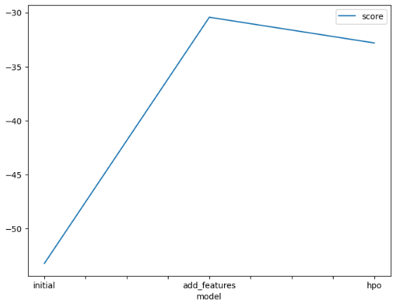
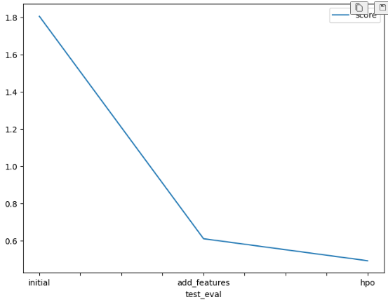

# Report: Predict Bike Sharing Demand with AutoGluon Solution
#### Sourabh Kumar

## Initial Training
### What did you realize when you tried to submit your predictions? What changes were needed to the output of the predictor to submit your results?
The second time I submitted my predictions, I got an error from Kaggle saying that there were unexpected columns in the file. I saw that AutoGluon's output included all the features used during training, but Kaggle only allows datetime and count. To fix this, I made a new DataFrame with just the datetime column from the test set and the predicted count values. I also clipped any negative values to zero since Kaggle doesn't allow negative counts.

### What was the top ranked model that performed?
The top-ranked model was WeightedEnsemble_L3. This model combined other models and used stacking to improve predictions.

## Exploratory data analysis and feature creation
### What did the exploratory analysis find and how did you add additional features?
I made a correlation heatmap and saw that hour had a positive relationship with count. Based on that, I extracted hour from the datetime column. I also added day and month. I changed features like season and weather to category data type so AutoGluon could process them better.

### How much better did your model preform after adding additional features and why do you think that is?
After adding hour, day, and month, the validation RMSE went from 53.10 to 30.33, and my Kaggle score went from 1.80401 to 0.61001. These changes helped because bike rentals follow patterns based on time. Adding these features made those patterns easier for the model to learn.

## Hyper parameter tuning
### How much better did your model preform after trying different hyper parameters?
I used a learning rate of 0.05 and set the number of iterations to 5000 for LightGBM (GBM), CatBoost (CAT), and XGBoost (XGB). I used 300 estimators for Random Forest. I didn't use early stopping. Instead, I relied on the 600-second time limit. AutoGluon handled the tuning using hyperparameter_tune_kwargs="auto".

I initially tested 10,000 iterations for all boosting models, but most runs ended early due to the 600-second limit. After reducing to 5,000 iterations, the Kaggle public score improved. The validation RMSE increased slightly from 30.33 to 32.75, but the public Kaggle score dropped from 0.61001 to 0.49175. This was slightly higher than the score of 0.47908 achieved with 10,000 iterations. Even though validation error worsened, the final model still generalized well.

This shows that tuning can help improve performance on test data, even if internal validation metrics don't improve. Using a lower iteration count allowed AutoGluon to try more model types and configurations, which may have contributed to the better test score.

### If you were given more time with this dataset, where do you think you would spend more time?
I would try more feature changes, like making new features for rush hour, binning temperature, and combining weather data. I would also test training models separately instead of stacking. I would explore more tuning methods and increase the number of tuning trials.

### Create a table with the models you ran, the hyperparameters modified, and the kaggle score.
| model        | hpo1                 | hpo2                         | hpo3              | score   |
| ------------ | -------------------- | ---------------------------- | ----------------- | ------- |
| initial      | default              | default                      | default           | 1.80401
 |
| add_features | default              | added `hour`, `day`, `month` | default           | 0.61001 |
| hpo          | learning_rate = 0.05 | num_boost_round = 5000       | no early stopping | 0.49175 |

### Create a line plot showing the top model score for the three (or more) training runs during the project.

TODO: Replace the image below with your own.

### Create a line plot showing the top kaggle score for the three (or more) prediction submissions during the project.

TODO: Replace the image below with your own.

## Summary
I started with a default model, added new features, and tuned the hyperparameters. The validation RMSE went from 53.10 to 30.33 after feature changes. After tuning, it rose to 32.75, but the Kaggle score still improved from 1.80401 to 0.49175.

The final model worked better on test data even though the validation score wasn't the best. If I had more time, I would keep testing features, try new models, and run longer tuning sessions. AutoGluon made it easy to test different ideas and get results quickly.